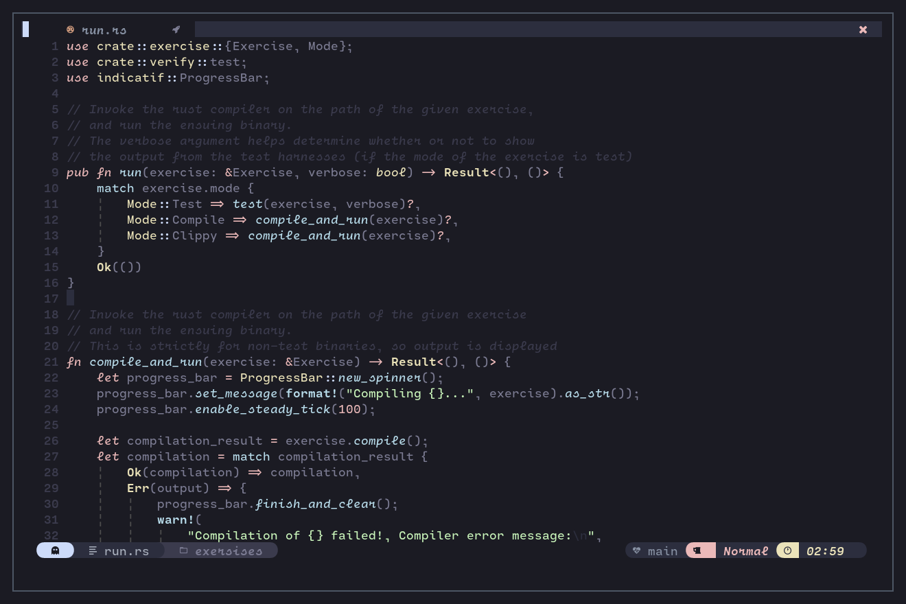

Aquarium theme for vim

The structure of the vimfile is forked from the Nord Vim, currently this is still in development, I apoligize for all the terrible rough edges

Here's a demo of how it looks

I know, the bar is not the same color, still working on it :)
